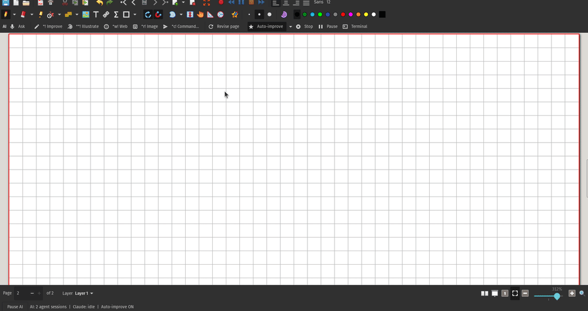
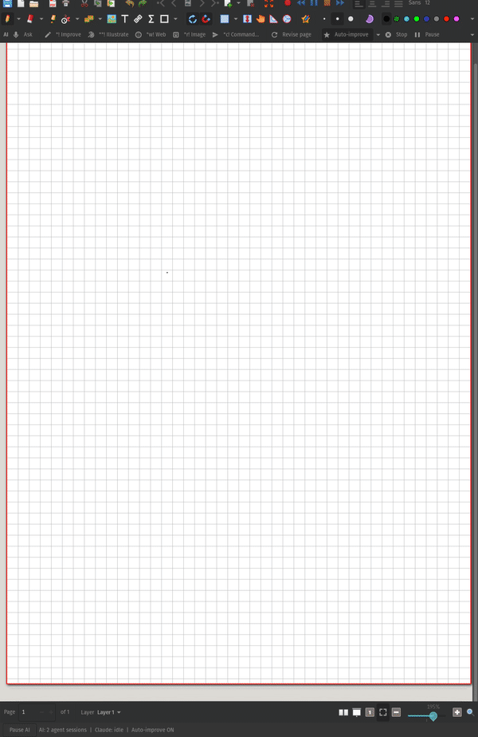

#   <br> xournalai

> [!WARNING]
> **This is an experimental fork of [Xournal++](https://github.com/xournalpp/xournalpp) for personal use.**
> It is not affiliated with or supported by the Xournal++ team. Things may be broken, unfinished, or change without notice.
> If you just want a stable note-taking app, use the [original project](https://github.com/xournalpp/xournalpp) and its
> [official releases](https://github.com/xournalpp/xournalpp/releases).




## About

xournalai is a handwriting and PDF annotation app with **AI built in**. It is based on Xournal++. You can use it in
two ways:

- **The built-in assistant:** a Claude Code session (or Codex) runs in a terminal docked in the window and serves your
  canvas. You point, write markers or speak; it thinks in the background and draws back into your notes.
- **Any MCP agent:** the running app hosts an [MCP](https://modelcontextprotocol.io) server, so Claude Code, Gemini
  CLI, OpenCode, Codex, Cursor or your own scripts can read your notes, draw in them with stylus-like pressure and
  operate the whole application.

Everything runs locally: the server only listens on `127.0.0.1` and needs a token. Speech is transcribed on your
laptop.

## The built-in assistant

| Feature | What it does |
|---|---|
| **AI terminal dock** (Ctrl+\`) | The serving session (Claude Code with its permissions bypassed by default, or Codex) in a collapsible dock, with tabs for other agents or a shell. It starts with the app and knows the canvas through a companion folder with its instructions, memory and skills. |
| **AI toolbar** | One-tap actions on the selection or the last thing you drew: **\*! Improve** (same object, drawn better), **\*\*! Illustrate**, **\*w! Web** (search and summarize next to it), **\*r! Image**, **\*c! Command…**, **Revise page**. Also **Stop**, **Pause** and the terminal. |
| **Markers** | Write `*!`, `**!`, `*w!`, `*r!` or `*c!` next to something in your notes; the assistant spots it and acts. |
| **Auto-improve** (Ctrl+Alt+I) | On: whatever you write is improved as you go (formulas to LaTeX, text in your own handwriting font, diagrams redrawn, consistent colours), with rules you choose. Off: only markers and requests. |
| **Ask: point and say** | Hold the pen's first button, speak, and circle the area; or press **Ask** (Ctrl+Alt+A) and circle with the pen or mouse. A popover opens there with your words (editable), command icons sized for a stylus (Improve, Illustrate, Write, Revise, Style, Explain, Summarize), a microphone button and Send. Without speaking, the button keeps its usual tool. |
| **Local speech to text** | whisper.cpp in a small helper (`xournalai-stt`), English, about a second per request. A recording pill next to the pen (pulsing red dot, level bars that move with your voice), "Transcribing", or "Didn't catch that". |
| **Visible thinking** | Every request gets a zone on the page with a status pill: waiting, thinking (orbiting dots), done, failed. Click its spinner to cancel. The zone stays while a background subagent works. |
| **Parallel work** | The serving session hands requests to up to 5 background subagents (a quick one and an artist) and stays responsive. Their edits land as **transactions**: prepared in a private draft, played in order like a stylus, one undo step each, checked for conflicts with what you changed meanwhile. |
| **Audio notes** | When you stop a recording, you choose what it is: **Instructions** (Claude transcribes it and does what you said), **Notes** (a transcript to keep, with a summary and where your ink fits; never treated as instructions) or **Keep audio**, and say what AI should do with it (typed, spoken or with quick chips like Summarize or Flashcards). While Claude works on it, a zone and the status line show each step. Every stroke knows its moment in the audio. |
| **No freezes** | Agents' reading and rendering run off the UI thread; your pen is never blocked by them. A watchdog reports any UI stall (`app_status`). |

## Pen and canvas

- **Pinch zoom** on touchscreens follows your fingers, also with gesture daemons (Touchégg) that send zoom keys.
- **Deep zoom** toggle next to *Zoom in*: up to 3000%, rendering only the visible part so memory stays flat.
- Page and preview rendering never hold up your strokes.
- **Fine graph** paper by default: 2.5 mm squares with light, thin lines.
- **Recording indicator** in the status line while the audio recorder is on: a pulsing dot, the live level, the time
  and a Stop button. While Ask listens, it animates with your voice too.

## What any agent can do

| Area | Examples |
|---|---|
| **Understand** | Render pages to look at them, list strokes/text/images with their positions, find layout blocks and crop them for reading handwriting, read the text of an annotated PDF, recognise sketched shapes. Built-in recipes: *summarize*, *extract text*, *explain figure*. |
| **Draw like a pen** | `pen_draw` drives the app's real stylus pipeline with pressure profiles (ink, brush, pencil, calligraphy, marker), at hand speed so you can watch. It can erase and lasso-select too. `user_style` learns the pressure of *your* strokes and `match_user` draws in your hand. |
| **Create directly** | Strokes with per-point pressure, shapes (arrows, polygons, Béziers, arcs, coordinate systems, optionally hand-drawn), text, LaTeX, images, links, whole SVG illustrations. It can also find free space on the page. Drafts let it iterate privately before showing the result. |
| **Edit** | Move, scale, rotate, restyle, delete or select elements by id. Undo/redo and history. **Transactions**: claim an area, prepare in a draft, commit an ordered list of edits as one undo step, with conflict checks. |
| **Control the app** | Run any of the ~130 menu/toolbar actions, choose menu entries visibly, operate dialogs and file choosers, press shortcuts. Manage pages, layers, tools, zoom and view; use the clipboard. |
| **Files** | Open, save, save as, new, close; export to PDF/PNG/SVG; import images, PDFs and SVGs. |
| **Work together** | `wait_for_user` returns when you've drawn something and paused, with a picture of it. A change log tells your strokes from the agent's. The agent sees your page, pointer, selection and tool, and can leave short callouts on the canvas. |
| **Remember** | `notes` keeps transcripts, summaries and meanings of drawings next to the file (`<file>.ai-notes.json`). |
| **Listen** | `audio_recorded` events for finished recordings, the audio moment of every stroke written during one, and `audio_transcribe` (local, English, timestamped). |
| **Show progress** | `thinking` zones on the canvas; `app_status` reports the session, the speech helper and UI stalls. |

The full reference is generated from the running server: [docs/mcp/TOOLS.md](docs/mcp/TOOLS.md) (63 tools) and
[docs/mcp/COVERAGE.md](docs/mcp/COVERAGE.md) (every action, menu, dialog and Lua API function).

## You stay in charge

- **AI Agent menu**, and a **status strip** at the bottom of the window showing whether the server is listening,
  the agents connected and what they are doing.
- **Pause AI agent** (button in the strip, menu, or **Ctrl+Alt+Esc**): every agent call is refused until you resume.
  A stroke in progress lifts the pen and your tool is restored.
- **Permissions** by tier: *read*, *draw*, *ui*, *files*, and *destructive* (discard unsaved work, overwrite, quit),
  which is off by default. Safety backups are made before risky operations.
- **AI Agent Settings…** sets the server on/off, port, token, permissions, where drawings go and animation. Agents
  cannot open these settings, and they cannot pause or resume themselves.
- **Where drawings go**: by default into your **current layer**, so you can erase and edit them right away. Set the
  layer to `AI` to keep them on a separate layer that you accept (merge), hide or clear from the AI Agent menu.
- **Stop** (AI toolbar) ends what the AI is doing now: open transactions are aborted, a drawing in progress
  finishes at once, queued requests are dropped. Each thinking zone's spinner cancels just that request.
- Everything the agent does is an ordinary undo step.

## Getting started

Build and install (see [LinuxBuild.md](readme/LinuxBuild.md) for dependencies; CMake, Ninja and a C++20 compiler):

```sh
cmake -S . -B build -G Ninja -DCMAKE_INSTALL_PREFIX=$PWD/build/install -DCMAKE_BUILD_TYPE=RelWithDebInfo
cmake --build build --target install
tools/register-desktop.sh        # optional: a "xournalai" launcher with its own icon
build/install/bin/xournalpp
```

**The built-in assistant** needs [Claude Code](https://claude.com/claude-code) (or Codex) installed and signed in.
It starts in the AI terminal dock with the app (settings: *AI Agent Settings…*). The speech model (148 MB) is
downloaded on first use into `~/.local/share/xournalai/models`.

**Another agent**: connect it **once**. The stdio bridge reads the token itself, so the agent works whenever xournalai is running:

```sh
claude mcp add -s user xournalai -- $PWD/build/install/bin/xournalpp --mcp-stdio
```

- The agent always has xournalai's tools. While the app is closed, a call answers "xournalai is not open, ask the
  user to open it"; as soon as you open it, the same session just works, with no reconnect. The agent never
  reopens a window you closed. Only its very first call, if you haven't started xournalai at all yet, opens it.
- **AI Agent → Connect an Agent…** has it ready to copy, with your paths and token filled in: a universal
  `mcpServers` JSON block (stdio or HTTP) for any MCP client, the bare URL and header, and commands for Claude Code,
  Codex, Gemini CLI and OpenCode. The same is in the `_help.connect` section of `~/.config/xournalpp/mcp.json`.
- Over HTTP instead: `http://127.0.0.1:7474/mcp` with `Authorization: Bearer <token>`.
- More setups (Cursor, the HTTP variants) are in [docs/mcp/CLIENTS.md](docs/mcp/CLIENTS.md).

Then just ask, e.g. *"summarize page 2"*, *"draw a labelled diagram of a heat engine next to my notes"*, or
*"wait until I finish this sketch and then clean it up"*.

## Development

- Plan, roadmap and changes: [docs/mcp/PLAN.md](docs/mcp/PLAN.md), [ROADMAP.md](docs/mcp/ROADMAP.md),
  [CHANGELOG.md](docs/mcp/CHANGELOG.md).
- The MCP code is in `src/core/mcp` (protocol, transport, tools) and `src/core/api` (typed services); the assistant
  (terminal dock, toolbar, markers, Ask, speech, zones) in `src/core/assistant`; the speech helper in `src/stt`.
- Options: `-DENABLE_MCP=OFF` (no agent server), `-DENABLE_AI_TERMINAL=OFF` (no dock; needs vte-2.91 otherwise),
  `-DENABLE_STT=OFF` (no speech helper; otherwise whisper.cpp is fetched and linked statically).
- Tests: `ctest` (unit tests, configure with `-DENABLE_GTEST=on`) and
  `python3 test/mcp_integration/run.py` (end-to-end scenarios against the installed build under Xvfb).
- `tools/mcpdoc/gen_docs.py` regenerates the reference docs; `tools/mcpdoc/client_matrix.py` checks installed agents.

## Original project

All credit for Xournal++ goes to its authors and contributors (see [AUTHORS](AUTHORS)).

- Repository: https://github.com/xournalpp/xournalpp
- Website & user guide: https://xournalpp.github.io
- Report upstream bugs and contribute there, not here.

## License

GNU GPL v2 or later, same as upstream. See [LICENSE](LICENSE).
